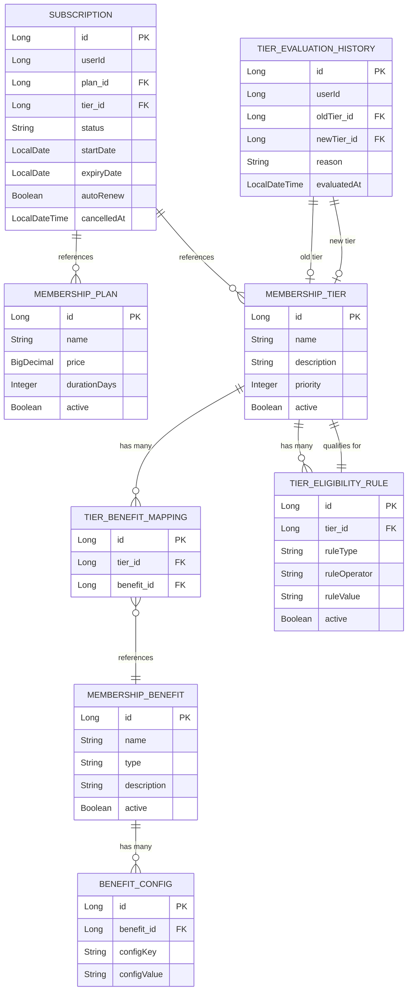

# FirstClub Membership Service

A Spring Boot-based membership management service for FirstClub that handles subscription lifecycle, tier management, and benefit delivery using a strategy pattern for flexible benefit evaluation.

## Architecture Overview

The service follows a 3-layer architecture:

```
Controller Layer          → SubscriptionController, TierController, BenefitController, PlanController, TierEvaluationController
         ↓
Service Layer             → SubscriptionService, BenefitService, TierEvaluationService, RuleEvaluator
         ↓
Repository / Strategy     → JPA Repositories, BenefitStrategy (interface), RuleEvaluator strategies
```

**Key Packages:**
- `controller/` - REST API endpoints
- `service/` - Business logic
- `repository/` - Data access (JPA)
- `strategy/benefit/` - Benefit strategy implementations (Strategy pattern)
- `strategy/eligibility/` - Rule evaluator implementations (Rule evaluation framework)
- `entity/` - JPA entities
- `dto/` - Data transfer objects
- `mapper/` - Entity to DTO mappers
- `exception/` - Custom exceptions and global exception handler

## ER Diagram



## Tech Stack

- **Java 25** - Runtime
- **Spring Boot 4.0.6** - Framework
- **Maven** - Build tool
- **MySQL 8+** - Production database
- **JPA / Hibernate** - ORM
- **Lombok** - Boilerplate reduction
- **Flyway** - Database migrations
- **Spring Validation** - Input validation
- **OpenAPI/Swagger** (`springdoc-openapi 2.8.4`) - API documentation
- **JUnit 5** - Unit testing
- **Mockito** - Mocking
- **Testcontainers** (`1.20.6`) - Integration testing with Docker

## Design Decisions

### Strategy Pattern for Benefits (Open-Closed Principle)

Benefits are delivered through a strategy interface (`BenefitStrategy`) allowing new benefit types to be added without modifying existing code. Each strategy handles a specific benefit type (e.g., `DiscountBenefitStrategy`, `FreeShippingBenefitStrategy`). The `BenefitService` evaluates all applicable strategies based on the user's tier and plan.

### Rule Evaluation Framework for Tier Qualification

Tier eligibility uses a rule-based evaluation framework (`RuleEvaluator`) with pluggable rules (`OrderCountRule`, `TotalSpendRule`, etc.). This allows business users to define and modify tier qualification criteria via database configuration without code changes.

### Optimistic Locking with `@Version`

The `Subscription` entity uses `@Version` for optimistic locking to prevent concurrent modification conflicts. When two transactions try to modify the same subscription simultaneously, the second transaction receives a `ConcurrentModificationException`.

### `OrderMetricsProvider` Abstraction

The `OrderMetricsProvider` interface abstracts order data retrieval, allowing the service to work with real order services in production or in-memory mock data for testing. This separation of concerns enables independent testing and future integration with external order management systems.

### Separate Plan and Tier Entities

Plans (pricing/duration) and Tiers (benefits/priority) are separate entities with a many-to-one relationship to Subscription. This allows:
- Same plan to be used across different tiers
- Tier upgrades/downgrades without changing the plan
- Independent plan and tier configuration management

## How to Run Locally

### 1. Start MySQL with Docker Compose

```bash
cd /Users/pthirumalayadav/IdeaProjects/firstclub-membership
docker-compose up -d
```

### 2. Run the Application

```bash
./mvnw spring-boot:run
```

The application starts on `http://localhost:8080`

### 3. Run Tests

```bash
./mvnw clean verify
```

This runs both unit tests and integration tests (using H2 in-memory database for tests).

## API Usage Examples

### Create Subscription

```bash
curl -X POST http://localhost:8080/api/v1/subscriptions \
  -H "Content-Type: application/json" \
  -d '{
    "userId": 1,
    "planId": 1,
    "tierId": 1
  }'
```

### Get Current Subscription

```bash
curl -X GET http://localhost:8080/api/v1/subscriptions/1
```

### Upgrade Tier

```bash
curl -X PUT http://localhost:8080/api/v1/subscriptions/1/upgrade \
  -H "Content-Type: application/json" \
  -d '{"targetTierId": 2}'
```

### Cancel Subscription

```bash
curl -X PUT http://localhost:8080/api/v1/subscriptions/1/cancel
```

### Evaluate Tier

```bash
curl -X POST http://localhost:8080/api/v1/tier-evaluation/users/1/evaluate
```

### Get Benefits

```bash
curl -X GET http://localhost:8080/api/v1/benefits/users/1
```

## Assumptions

- **Order Metrics**: The `OrderMetricsProvider` uses in-memory data for demonstration. In production, this should integrate with a real order service.
- **No Authentication Layer**: User IDs are passed explicitly in requests. Production deployments should integrate with an authentication service (JWT, OAuth2, etc.).
- **User ID Context**: User identification relies on explicit `userId` parameters rather than extracted from authentication tokens.

## Future Improvements

- **Real Order Service Integration**: Replace `InMemoryOrderMetricsProvider` with actual order service client (REST/gRPC)
- **Caching**: Add Redis caching for frequently accessed tier and benefit data
- **Event-Driven Tier Changes**: Publish tier change events to a message broker (Kafka/RabbitMQ) for downstream systems
- **Payment Gateway Integration**: Add payment processing for subscription renewals and tier upgrade charges
- **Authentication**: Add JWT/OAuth2 authentication layer to extract user context from tokens